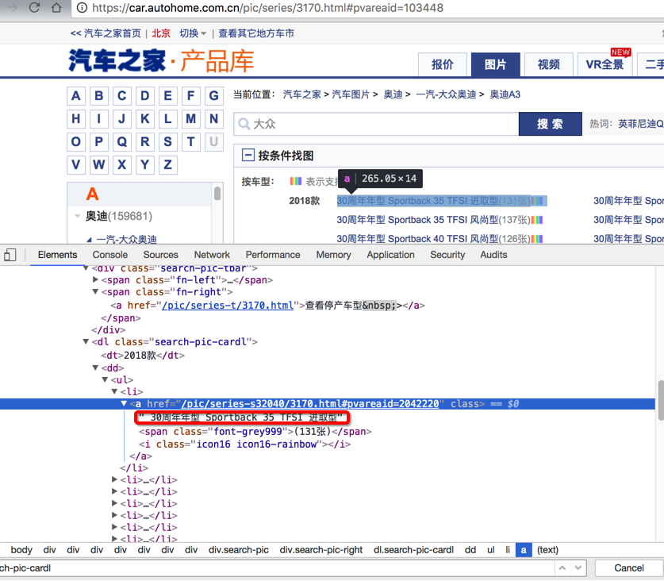
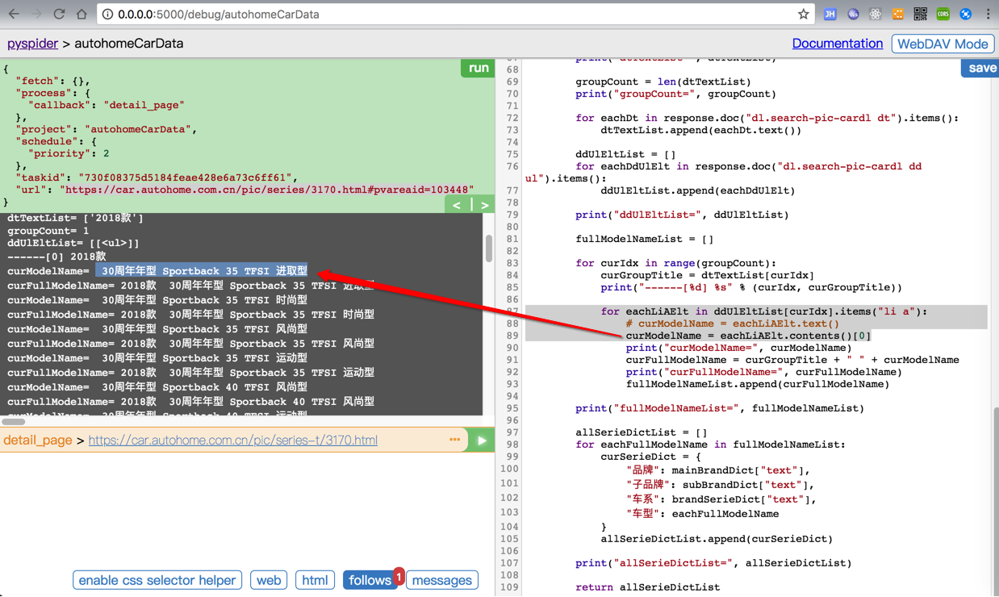
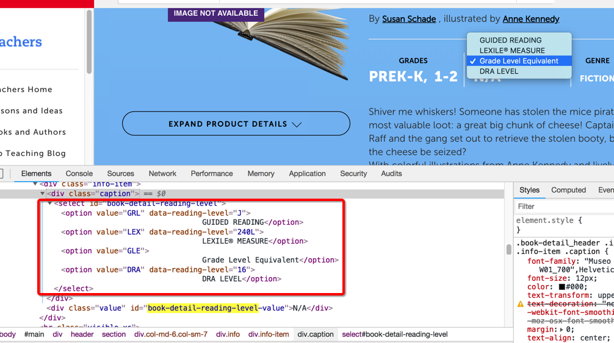
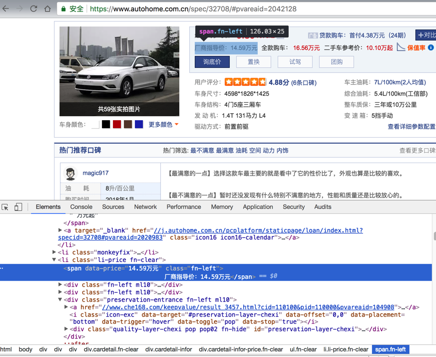
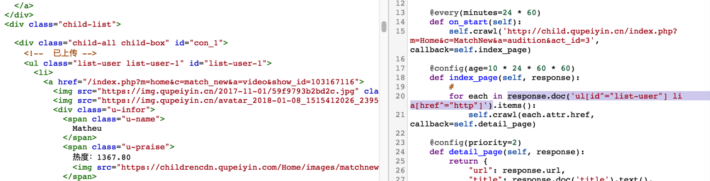
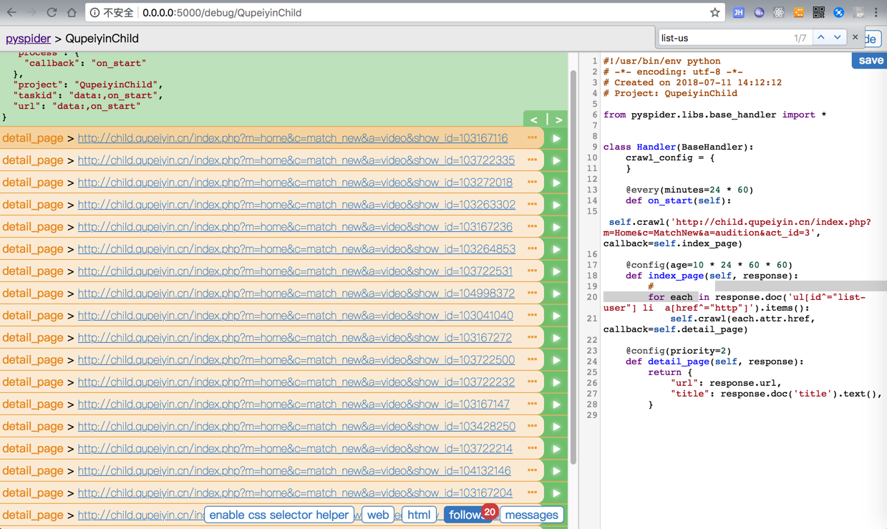
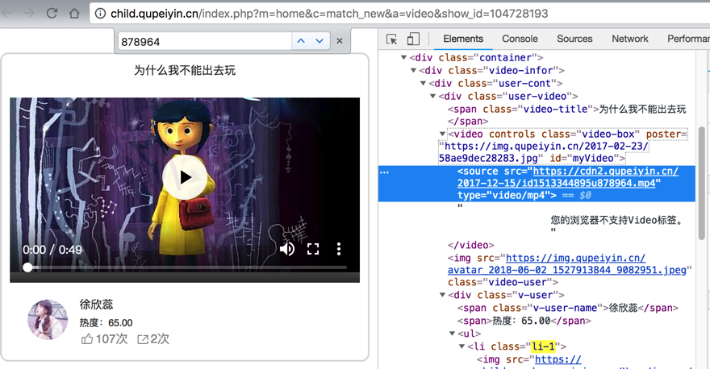
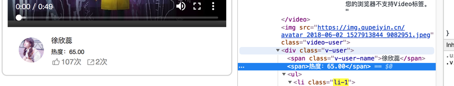

# PyQuery常见操作

## 获取元素的文本值

举例：html

```html
<p class="contributors">
  By
  <a href="/teachers/authors/judy-love.html" target="_self"><strong> Judy Love</strong></a>
  ,
  <a href="/teachers/authors/julie-danneberg.html" target="_self"><strong> Julie Danneberg</strong></a>
</p>
```

写法：

`curHtmlElement.text()`

举例：

```python
authors = []
for eachAuthor in response.doc('p[class="contributors"] a[href] strong').items():
    print("eachAuthor=%s", eachAuthor)
    authorText = eachAuthor.text()
```

详见官网文档：

https://pythonhosted.org/pyquery/api.html#pyquery.pyquery.PyQuery.text

### 获取含有子元素的`a`的本身的`text`

页面：



html

```html
<a href="/pic/series-s32040/3170.html#pvareaid=2042220" class=""> 30周年年型 Sportback 35 TFSI 进取型
  <span class="font-grey999">(131张)</span>
  <i class="icon16 icon16-rainbow"></i>
</a>
```

想要：获取a的本身的text

代码：

```python
for eachLiAElt in ddUlEltList[curIdx].items("li a"):
    curModelName = eachLiAElt.contents()[0]
```

输出值：`30周年年型 Sportback 35 TFSI 进取型`

效果：



* 官网文档
  * [pyquery.pyquery.PyQuery.contents](https://pythonhosted.org/pyquery/api.html#pyquery.pyquery.PyQuery.contents)
    * > Return contents (with text nodes)
  * 和之前用过的`BeautifulSoup`的`contents`是类似的
    * [BeautifulSoup contents](https://www.crummy.com/software/BeautifulSoup/bs3/documentation.html#contents)
      * > tag的 .contents 属性可以将tag的子节点以列表的方式输出


> #### warning:: 直接用`text()`会包含子元素的`text`值
> 如果直接用`text()`：
```python
for eachLiAElt in ddUlEltList[curIdx].items("li a"):
    curModelName = eachLiAElt.text()
```
> 是错误的写法。
> 
> 因为会把`span中`的`text`，此处的`(131张)`也包括在内


## 获取元素的属性的值

语法：

* `attr`
    ```python
    htmlElement.attr("property name")
    ```
* 如果`property name`是连接在一起的单词这种，比如`xxx`, `xxx_yyy`，那么可以写成：
    ```python
    htmlElement.attr.property_name
    ```

### 举例1

```html
<div class="caption">
    <select id="book-detail-reading-level">
        <option value="GRL" data-reading-level="J">
            GUIDED READING</option>
        <option value="LEX" data-reading-level="240L">
            LEXILE® MEASURE</option>
        <option value="GLE">
            Grade Level Equivalent</option>
        <option value="DRA" data-reading-level="16">
            DRA LEVEL</option>
    </select>
</div>
```



对应代码：

```python
readingLevelSelectElement = readingLevelElement.find('select[id="book-detail-reading-level"]')
print("readingLevelSelectElement=%s" % readingLevelSelectElement)
guidedReading = readingLevelSelectElement.find('option[value="GRL"]').attr("data-reading-level")
lexileMeasure = readingLevelSelectElement.find('option[value="LEX"]').attr("data-reading-level")
gradeLevelEquivalent = readingLevelSelectElement.find('option[value="GLE"]').attr("data-reading-level")
draLevel = readingLevelSelectElement.find('option[value="DRA"]').attr("data-reading-level")
print("guidedReading=%s" % guidedReading)
print("lexileMeasure=%s" % lexileMeasure)
print("gradeLevelEquivalent=%s" % gradeLevelEquivalent)
print("draLevel=%s" % draLevel)
```

即可提取到内容：

```bash
readingLevelSelectElement=<select id="book-detail-reading-level">
                                <option value="GRL" data-reading-level="J">
                                        GUIDED READING</option>
                                <option value="LEX" data-reading-level="240L">
                                        LEXILE® MEASURE</option>
                                <option value="GLE">
                                        Grade Level Equivalent</option>
                                <option value="DRA" data-reading-level="16">
                                        DRA LEVEL</option>
                        </select>
guidedReading=J
lexileMeasure=240L
gradeLevelEquivalent=None
draLevel=16
```

### 举例2

页面：



html:

```html
<span data-price="14.59万元" class="fn-left">
                            厂商指导价：14.59万元</span>
```

想要：获取`span`的`data-price`的属性的值

* 正确写法
    ```python
    msrpPriceStr = msrpPriceElt.attr("data-price")
    ```
* 错误写法：
    ```python
    msrpPriceStr = msrpPriceElt.attr.data-price
    ```

> #### warning:: 不是用`PyQuery.val`去获取元素属性值
> 
> 注意此处不是
> 
> [pyquery – PyQuery complete API — pyquery 1.2.4 documentation](https://pythonhosted.org/pyquery/api.html)
> 
> 中的：
```python
PyQuery.val(value=<NoDefault>)
```
> 去获取属性的值的

## `CSS`选择器的写法

### `attribute = value`类的元素定位

#### 例子1

调试看到的 html代码是：

```html
<ul class="list-user list-user-1" id="list-user-1">
  <li>
    <a href="/index.php?m=home&c=match_new&a=video&show_id=103167116">
```

`PySpider`内部会自动加上当前host，即http前缀的`http://xxx`，实际上是：

```html
<ul class="list-user list-user-1" id="list-user-1">
  <li>
    <a href="http:://xxx/index.php?m=home&c=match_new&a=video&show_id=103167116">
```

(`PySpider`中的)`PyQuery`的写法：

```python
response.doc('ul[id^="list-user"] a[href^="http"]')
```

或：

```python
response.doc('ul[id^="list-user"] li  a[href^="http"]')
```



（PySpider中的）效果：可以找到元素



#### 例子2

页面：



```html
<video controls="" class="video-box" poster="https://img.qupeiyin.cn/2017-02-23/58ae9dec28283.jpg" id="myVideo">
    <source src="https://cdn2.qupeiyin.cn/2017-12-15/id1513344895u878964.mp4" type="video/mp4"> 您的浏览器不支持Video标签。
</video>
```

想要：获取src值

代码：

```python
# videoUrl = response.doc('video source[src$=".mp4"]')
videoUrl = response.doc('video source[src^="http"]').attr("src")
```

### `nth-child`类的元素定位

页面：



```html
<div class="v-user">
    <span class="v-user-name">徐欣蕊</span>
    <span>热度：65.00</span>
```

想要定位：`div`下面第二个`span`

css选择器的写法：

```python
div[class="v-user"] span:nth-child(2)
```


